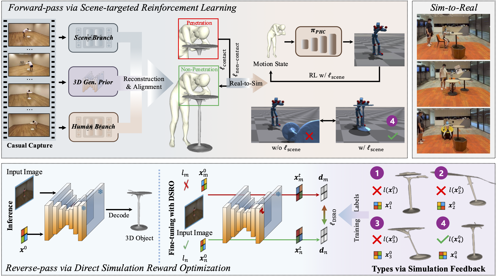

<div align="center">

# HSImul3R: Physics-in-the-Loop Reconstruction of Simulation-Ready Human–Scene Interactions

<a href="https://yukangcao.github.io/">Yukang Cao</a>,
<a href="https://haozhexie.com/about">Haozhe Xie</a>,
<a href="https://hongfz16.github.io/">Fangzhou Hong</a>,
<a href="https://frozenburning.github.io/">Zhaoxi Chen</a>,
<a href="https://scholar.google.com/citations?user=_DVnyb8AAAAJ&hl=zh-CN">Long Zhuo</a>,
<a href="https://ethan7899.github.io/">Liang Pan</a>,
<a href="https://liuziwei7.github.io/">Ziwei Liu</a><sup>†</sup>


[](https://arxiv.org/abs/2603.15612)
<a href="https://yukangcao.github.io/HSImul3R/"></a>


  
Please refer to our webpage for more visualizations.
</div>

## Abstract
We present **HSImul3R**, a unified framework for simulation-ready 3D reconstruction of human-scene interactions (HSI) from casual captures, including sparse-view images and monocular videos. Existing methods suffer from a perception-simulation gap: visually plausible reconstructions often violate physical constraints, leading to instability in physics engines and failure in embodied AI applications. To bridge this gap, we introduce a **physically-grounded bi-directional optimization pipeline** that treats the physics simulator as an active supervisor to jointly refine human dynamics and scene geometry. In the forward direction, we employ Scene-targeted Reinforcement Learning to optimize human motion under dual supervision of motion fidelity and contact stability. In the reverse direction, we propose Direct Simulation Reward Optimization, which leverages simulation feedback on gravitational stability and interaction success to refine scene geometry. We further present **HSIBench**, a new benchmark with diverse objects and interaction scenarios. Extensive experiments demonstrate that HSImul3R produces the first stable, simulation-ready HSI reconstructions and can be directly deployed to real-world humanoid robots.


## Pipeline
Given casual captures as inputs, we achieve simulation-ready reconstruction of human–scene interactions via a physics-in-the-loop optimization pipeline. We first propose to inject an 3D explicit generative prior into the reconstruction pipeline to achieve better alignment between human and scene. Then, **(1)** in the forward-pass, we propose a scene-targeted reinforcement learning that optimize the human motion to achieve interaction stability within the simulator, **(2)** in the reverse-pass, we introduce a direct simulation reward optimization (DSRO) to refine the scene geometry via simulation feedback regarding the stability. Specifically, we define the 4 types regarding the feedback. Type 1: objects not stabilizing under gravity; Type 2: objects failing to stabilize during human interaction; Type 3: objects stabilizing but without meaningful interaction; Type 4: objects with stable interaction.              



## ChangeLog
- [2026/03/16] Repository created.

## Misc.
If you want to cite our work, please use the following bib entry:
```
@article{
}
```
